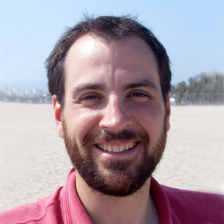
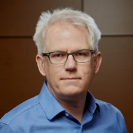
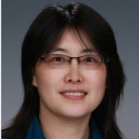
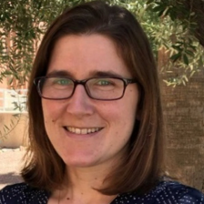

IDEAS-Watersheds brings together efforts across multiple labs and universities.  The matrixed organizational structure connects the Research Activities to ensure effective integration across teams.

  

<h2>Leadership Team</h2>
<table>
<tbody>
<tr>
<td></td>
<td valign="top"><strong>J. David Moulton, Project PI</strong> 
(Shared Infrastructure Activities Lead, Training/Community Building/Outreach Lead) 
<em>Los Alamos National Laboratory</em></td>
</tr>
<tr>
<td></td>
<td valign="top"><strong>Hai Ah Nam, Project Coordinator</strong> 
<em>Los Alamos National Laboratory</em></td>
</tr>
<tr>
<td></td>
<td valign="top"><strong>Steve Smith, Software Lead</strong> 
<em>Lawrence Livermore National Laboratory</em></td>
</tr>
<tr>
<td></td>
<td valign="top"><strong>Sergi Molins, Reaction Networks Cornerstone Co-Lead</strong> 
(Watershed Function SFA Partnership Lead, Fine-Scale Partnership Activity Lead) 
<em>Lawrence Berkeley National Laboratory</em></td>
</tr>
<tr>
<td></td>
<td valign="top"><strong>Scott Painter, Watershed Hydrobiogeochemistry Cornerstone Lead</strong> 
(Critical Interfaces SFA Partnership Lead) 
<em>Oak Ridge National Laboratory</em></td>
</tr>
<tr>
<td></td>
<td valign="top"><strong>Xingyuan Chen,</strong> <strong>Reaction Networks Cornerstone Co-Lead</strong> 
(River Corridor SFA Partnership Lead) 
<em>Pacific Northwest National Laboratory</em></td>
</tr>
<tr>
<td></td>
<td valign="top"><strong>Reed Maxwell, Continental Hydrology Cornerstone Co-Lead</strong> 
(CONUS Activity Co-Lead) 
<em>Princeton University</em></td>
</tr>
<tr>
<td></td>
<td valign="top"><strong>Laura Condon, Continental Hydrology Cornerstone Co-Lead</strong> 
(CONUS Activity Co-Lead) 
<em>University of Arizona</em></td>
</tr>
<tr>
<td></td>
<td valign="top"><strong>Dave Gochis, CONUS Activity Co-Lead 
</strong><em>National Center for Atmospheric Research</em><strong> 
</strong></td>
</tr>
</tbody>
</table>

[IDEAS-Classic]: https://ideas-productivity.org/ideas-classic/
[IDEAS]: https://ideas-productivity.org/

